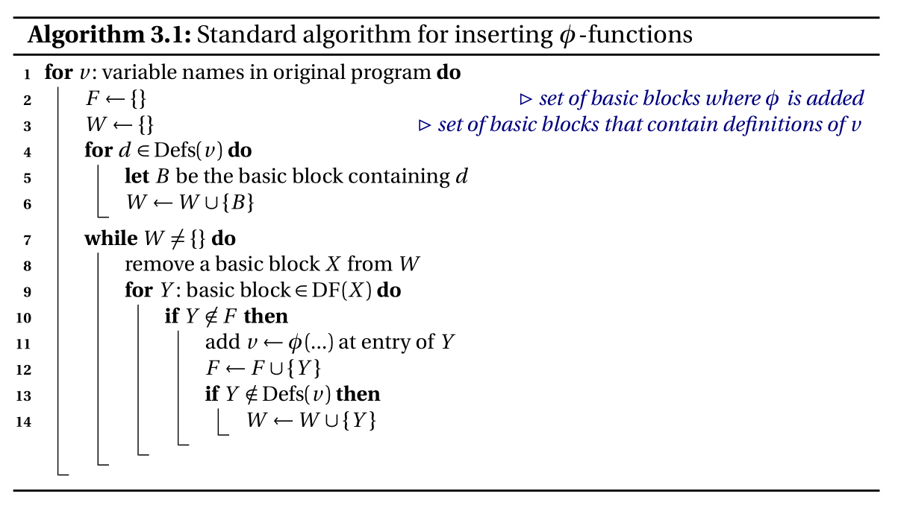

## Llvm中间代码生成
本次作业我选择**Llvm**作为中间代码，相关部分各个类的意义如下：
- `Value`:操作数类，该类被`User`使用，比如`$t1=$t2+$t3`中的`$t2`和`$t3`均属于此类，其拥有字符串属性`name`标识名称，`type`属性标识类型，`users`标识所有用到了自身的`User`。
```java
public class Value {
    protected String name;
    protected LlvmType type;
    protected ArrayList<User> users=new ArrayList<>();
}
```
- `User`：使用`Value`的类，被`Instr`和`BasicBlock`等类继承，拥有其所用的操作数的数组
```
public class User extends Value{
    protected ArrayList<Value> operands=new ArrayList<>();
}
```
- `Undef`：在生成`Phi`时，一个变量在所有路径中不一定都有定义，未定义的部分用`Undef`类填充。
- `Param`：函数参数类
- `Module`：顶层模块，拥有字符串常量数组，全局变量数组以及函数列表
```java
public class Module extends Value{
    private ArrayList<CstStr> cstStrs=new ArrayList<>();
    private ArrayList<GlobalVar> globalVars=new ArrayList<>();
    private ArrayList<Function> functions=new ArrayList<>();
}
```
- `Instr`：指令类，被多种具体地指令如`Alu`和`Jump`等继承，其使用了多个`Value`类，本身也是`Value`，其拥有枚举类型属性`instrType`标识指令类型以及所属基本块的指针。
```java
public class Instr extends User {
    public static enum InstrType {
        ALU,
        ALLOCA,
        BRANCH,
        CALL,
        GETPTR,
        ICMP,
        JUMP,
        LOAD,
        RETURN,
        STORE,
        ZEXT,
        GETINT,
        PUTSTR,
        PUTINT,
        PHI,
        MOVE
    }
    private InstrType instrType;
    private BasicBlock parentBlock;
}
```
- `Initial`：在变量声明时存储初始化值的类
- `Constant`：常量
- `BasicBlock`：基本块，其拥有一系列指令和其所属的函数的指针，并且**必须以Jump或Branch或Return等跳转语句结尾**。
```java
public class BasicBlock extends User {
    private ArrayList<Instr> instrs = new ArrayList<>();
    private Function parentFunc;
}
```
- `Function`：函数，其拥有形参数组，基本块数组和返回值类型。
```java
public class Function extends User {
    private ArrayList<Param> params = new ArrayList<>();
    private ArrayList<BasicBlock> blocks = new ArrayList<>();
    private LlvmType retType;
}
```
### 为什么选择Llvm
一方面，**Llvm**的`Value`和`User`的架构设计使得后续的优化变得简单，`Value`类的属性中包含所有引用了自己的`User`类。而我们在优化时，经常需要将`Value`替换为一个新值。比如说，我们有`$t1=1+10，$t2=$t1+$t1`，可以进行常量优化，将`$t1`替换为`11`，那我们要怎么样将`$t2=$t1+$t1`中的`$t1`都替换为`11`呢，得益于`Llvm`的架构设计，我们可以直接从`$t1`作为`Value`时的属性中拿到所有用到它的指令，如`$t2`，然后调用`$t2`作为`User`的方法，将其操作数中的`$t1`都替换为`11`，最后再将`$t1`指令从指令序列中去除，完成优化。
另一方面，标准的`Llvm`中间代码是可以被相关工具执行的，方便我们检验中间代码的正确性。
## Mips代码生成
完成**Llvm**后，**Mips**代码的生成就较为简单了。但由于**Llvm**的结构将函数调用总结为`Call`语句而不涉及相关的内存管理，我们仍需要在`Call`语句的翻译上下功夫。
### 函数调用的翻译
- 首先，我们要保存已经分配的全局寄存器值，将其存储在栈中，让栈向下增长。
- 然后，我们将前三个参数保存到`$a1-$a3`寄存器上，并为其在栈上预留空间，再将第四个及之后的参数都保存在栈上。
- 将栈指针`$sp`的值以及本函数的返回地址保存在栈上。
- 将栈指针`$sp`指向函数第一个参数所在栈的位置，`Jal`跳转到被调用函数。
- 恢复现场，从栈中读取栈指针的原值并恢复栈指针的位置，恢复返回地址`$ra`,恢复全局寄存器的值。
### 全局寄存器分配
寄存器分配策略上我选择了**引用计数线性寄存器分配策略**，在完成活跃变量分析后具体的分配策略如下。
- 对于每个函数，初始化`var2reg`存储变量被分配到的寄存器，`reg2var`存储全局寄存器当前被分配给了哪个变量，`useCnt`存储每个变量的引用计数。遍历函数的每条指令，如果某变量被某条指令引用或者是某条指令的结果，那么该变量的引用计数加一。
- 从函数的入口块开始， 按照支配树访问每个块。

- 对于每个块，遍历块中指令，将每个变量最后一次被使用的（指令）位置存储在lastUse中。

- 再次遍历一遍指令，如果指令用到的某个变量是其在块中最后一次被使用（即变量的`lastUse`是当前的指令），并且该变量不在块的`Out`集中（即该变量在之后的块中都不活跃），那么我们就将其被分配的寄存器释放出来，并将该变量加入`neverUsed`集中。如果该指令有左值（如`$t1=$t2+$t3`，`store`等指令则没有左值），那么我们需要尝试为它分配寄存器（如果有空余寄存器，直接分配，否则考察它和那些已经被分配寄存器的变量的引用计数大小，若有引用计数比它小的，则将对应其寄存器释放出来分配给它），并将指令加入`locaDef`集中，表明它是在当前块中定义的。

- 遍历当前块的直接支配的子块，首先将那些已经被分配寄存器的但不在子块的`In`集中（即不在子块中活跃，可能在其它子块中活跃）的变量加入`curChildNeverUse`集中，并将其对应的寄存器都释放出来。访问子块。子块访问结束后，由于`curChildNeverUse`中的变量可能在其它子块中活跃，我们需要根据`curChildNeverUse`恢复这些变量使用的寄存器。访问下一个子块。

- 子块遍历结束后，将`localDef`的变量对应的寄存器释放出来（因为这些变量是在本块中定义的，父块用不到）；再将`neverUsed`集中的变量对应的寄存器重新分配给它们（因为子块和本块不再用不代表父块和兄弟块不用）。

- 当前块访问结束。
### Phi指令的消除
该阶段我们需要将`Phi`指令转换为一系列`Move`指令，具体如下：
- 对于每一条`Phi`指令，考察其中的每一个来源块，若来源块只有一个子块（即末尾是`Jump`指令），那么我们直接在来源块的末尾添加`Move`指令即可；若来源块有两个子块（即末尾是`Branch`指令），那么我们需要在来源块和本块间新增一个中间块，并将`Move`指令放在中间块中。
- 完成所有`Phi`指令到`Move`指令的转化后，我们考察每个块末尾的一系列`Move`指令，如果出现以下情况：
```assembly
//LlvmIR阶段
move %t1,%t2 
move %t3,%t1 //在Llvm%t3实际上获得的是%t2的内容而不是%t1原来的值
//Mips寄存器阶段
move $t1,$t2
move $t3,$t1 //虽然在LlvmIR阶段没有违背并行赋值，但在分配寄存器后，仍可能出现寄存器层次上的违背并行赋值
```
由于每个块的Phi指令在语义上应该是并行运行的，因此我们需要新增中间变量或中间寄存器，暂存$t1或%t1的原值。
## 代码优化设计
### 不可到达语句的删除
在生成的初始中间代码中，基本块的跳转或分支指令后可能还有指令（这是不被Llvm允许的，基本块必须以唯一的跳转或分支指令结尾），因此我们需要将基本块的首个跳转或分支指令后的指令删去。
### 不可达块的删除
根据块间的跳转关系，我们从入口块开始遍历当前函数可以到达的基本块，将那些不可达基本块删去。
### 控制流图和支配树生成
根据块间的跳转关系，我们参考有关算法构建出控制流图和支配树，并计算出支配边界，为之后`Mem2Reg`做准备。
### 全局变量局部化
有些全局变量只在一个函数中被使用，那它便没有作为全局变量的必要了，我们可以将其转化为局部变量。通过这种方式，我们省略了访问全局变量的内存指令。
### Mem2Reg
我们生成的**LlvmIR**通过将变量对应到内存地址并在访问时`load`和`store`的方法形成了伪**SSA**，我们在该阶段需要消除这些`load`和`store`，实现真正的单赋值形式。
#### Phi生成
我们需要利用支配树和支配边界的信息在块的开始插入Phi指令。这是因为同一变量可能在不同块中被定义，这些块汇聚到使用该变量的子块中，我们便无法知道实际运行过程中该变量的值究竟是来自哪个父块的定义。而**Phi**指令通过`$t1=phi [$t2,%b1],[$t3,%b2]`的形式解决了这个问题，如果子块是由父块`%b1`跳转而来，那么我们将`$t1`赋成`$t2`的值；如果是从父块`%b2`跳转而来，就将`$t1`赋成`$t3`的值。具体算法如下：


#### 变量重命名
**Phi**生成后，我们需要消除`load`和`store`指令，考察`load`指令的意义，其将变量从变量所在地址取出，而取出的值应该是最新一次`store`存入的值。因此我们可以定义一个栈来保存变量当前最新的值，每处理一个`store`指令，我们都将存入的值加入栈顶；每处理一个`load`指令，我们都从栈顶取出最新的值，并将之后用到`load`的值的地方都改为栈顶的值。最后我们删除`load`和`store`指令即可。

### 副作用分析
分析我们定义的函数，可以发现，有些函数是和表达式一样简单的，如
```c
int add(int a,int b){
	return a+b;
}
```
这样的函数可以看作一个黑盒，给定输入，给出输出，而不会对运行状态造成任何影响。这些函数可以看作是没有副作用的。
而有些函数调用了getint()和putstr()等IO指令，或者访问和修改全局变量，这些则是有副作用的函数。
我们在副作用分析中为每个函数定义是否有副作用，这些信息在之后的**GVN**(重复`Call`指令的消除)和死代码删除中会起到作用。

### 死代码删除
首先，我们认为`Branch、Jump、Call`有副作用的函数、`Return`和`IO`指令都是不能在死代码删除中被删去的，而这些指令需要用到某些变量，因此这些变量对应的指令也是不能被删除的，同样这些指令用到的变量也是不能被删除的，按照这样的规则我们找到所有不能被删除的指令。最后删去那些没有被访问到的即可以删除的指令。
### Phi优化
若**Phi**指令的来源值均为同一个，那么**Phi**就没有存在的必要了，可以将用到**Phi**值的指令直接替换为来源值。
### 函数内联
函数内联可以节省函数调用过程中保存上下文消耗的时间，步骤如下：
- 将`Call`指令所在的块分为两部分，`Call`指令以上（包括`Call`指令）成为一块，其余成为下一块，新增`Jump`指令从上一块跳转到下一块并维护块之间的父子关系。
- 克隆被调用的函数，将其化为能够插入调用函数中的一系列基本块，注意这些基本块和其中指令的命名都需要从调用函数当前的最大`varid`和`blockid`开始，以保证**SSA**形式的正确性。
- 将克隆函数插入到`Call`指令所在的位置，将其中的形参都替换为`Call`指令中的实参，其中的`Return`替换为到到Call指令的下一块的`Jump`指令。由于可能从不同的块中`Return`到下一块，涉及到被`Return`的值的多来源问题，因此需要在下一块的开头添加`Phi`指令。
### 全局值标号
全局值标号可以消除重复计算的指令，该部分我采用将每个指令转换为对应的**Llvm**格式的字符串来作为标号，若有两个指令对应的字符串一致，则可以消除后出现的指令，并将用到后一个指令值的指令中对应的值替换为前一个指令的值。
### 全局代码移动
该部分的优化在于将循环中重复计算的指令提升到循环之外。对于每个指令，最早使用到指令值的指令位置为指令可以提升到的下界，该指令用到的值对应的指令中最晚产生结果的指令对应的位置是该指令可以提升到的上界，在上界和下界之间，我们寻找其中循环深度最小的位置，将指令放置其中。
### 无用跳转语句的删除
由于LlvmIR要求基本块中的指令必须以跳转或分支指令结尾，中间代码中会出现相当多的跳转指令目标就是紧接着的下一个基本块的情况。而Mips代码则没有这个限制，因此我们可以将那些跳转目标为紧接着的下一基本块的跳转指令删除。在寻找这些指令之前我们也可以通过移动基本块的位置来产生尽可能多的无用跳转语句。
### 窥孔优化
#### 无用move指令删除
删除出现如下情况的move指令：
    move $t1,$t2 ; move $t1,$t3 => move $t1,$t3
    move $t1,$t1 => null
    
