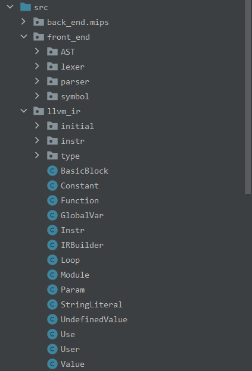

# 编译课程设计文档
## 参考编译器介绍
我参考的是hyggge学长的Petrichor编译器。该编译器结构清晰，很好地利用了面向对象语言的继承和多态等特性，简化了代码的编写。另外，编译的各个阶段代码的耦合程度也很低，设计得相当漂亮。
### 总体结构

### 接口设计
词法分析阶段的Lexer产生的单词流TokenStream传递到Parser，语法分析阶段的Parser产生语法树，中间代码生成阶段直接调用语法结点内的相关方法配合全局的IRBuilder单例模式类，递归下降地产生LlvmIR中间代码，并进行中端优化。优化后的中间代码调用中端指令类中的生成方法生成Mips目标代码。
### 文件组织


## 编译器总体设计
### 总体结构

### 接口设计
TokenParser读入源文件，进行词法解析产生单词流TokenStream并传输到语法分析中，SyntaxParser进行语法分析的同时进行错误处理，错误处理部分与符号表交互信息，并在ConstDefNode和VarDefNode等节点类中存储符号信息，为中间代码生成做准备。语法分析产生的节点树被传送到负责LlvmIR中间代码生成的IRBuilder类，IRBuilder类与符号表进行交互，递归下降地生成LlvmIR中间代码，得到顶层模块Module。Module在Optimizer的中端优化类中得到优化并进行寄存器的分配。优化后的中间代码传送到AsmBuilder类中进行汇编代码的生成。
### 文件组织


## 词法分析设计
### 编码前设计
#### 阶段任务

按照以上词法规则，完成输入流的词法分析，即将字符流转化为可以被语法分析阶段识别的token单词流，方便此后的解析。

#### 总体设计

- 将词法分析有关的类封装在`TokenParser`软件包中，主要分析任务由`Lexer`类完成
- 将Token的类型封装在枚举类`TokenType`中，使得对`TokenType`的引用更加清晰，同时方便此后调用`toString()`方法完成`Token`的输出。
- `Token`类拥有`type`识别`token`的类型，`lineNum`标识`token`所在的行，`value`用于记录`formatString`等`TokenType`具体的值，将其定义为`String`类也是为了增加了该属性对于保存整数和字符串等不同类型值的通用性。
- 将单词流封装在`TokenStream`中，并实现`read()`，`unread()`和`look()`字符流预读等方法为此后的语法分析的字符流读取解析做准备。
- `Lexer`解析结束后，在`main()`方法中获取其中的`tokenStream`属性，并将其输出。
#### Lexer实现细节
- 采用`Java`提供的`PushbackInputStream`作为输入字符流的具体实现，并实现`read()`和`unread()`方法对输入字符流进行读取和预读，令`nchar`为当前处理的字符。

- 在读到源代码末尾（即`\uFFFF`）之前，一直调用`read()`读取单词，并将读取到的单词存入`tokenStream`中。

- 将对当前字符是否为字母、数字和空格的判断用`is...()`方法封装，使得解析过程更加清晰。

- 关于注释的处理：如果我们连续读到`//`或读到`/*`，那么我们就一直调用`read()`方法进行读取，直到读到换行符或下一个`/*`，注意我们在这里对一般会用循环进行处理，并在对`//`处理时将读到换行符作为循环终止条件，但如果`//`处于末行，我们始终无法读取到换行符，于是陷入死循环，这是我们需要新增对结束符的判断，将其添加为循环终止条件。

### 编码后修改

为了配合语法分析阶段对`TokenStream`中的单词流相关操作的需求，在`TokenStream`中新增了`setLastPos()`和`rollBackPos()`方法实现单词流的记录和还原，方便我们在语法分析阶段实现解析的回溯操作。

### 语法分析设计
### 编码前设计
#### 阶段任务
采用递归下降的方法按照文法说明对单词流解析，构建出语法树，该阶段默认输入流是符合文法说明的，无语法错误。
#### 总体设计
我们首先根据文法规则构建语法树的各种结点类，在`SyntaxParser`类中统一实现对各种语法成分的递归下降解析。
#### 实现细节
##### 语法树结点类的构建
```java
public class Node {
    private int startLine;
    private int endLine;
    public Node(int startLine,int endLine){
        this.startLine=startLine;
        this.endLine=endLine;
    }
    public int getStartLine() {
        return startLine;
    }
    public int getEndLine() {
        return endLine;
    }
}
```
首先定义一个结点父类Node，将结点所处的行数信息记录其中，再令其它更加具体的结点对其进行继承。
由于文法规则中的结点类型众多，我将结点分为三类，分别存放在不同的软件包中：
- 表达式有关的`...Exp`类：`AddExp`,`ConstExp`,`EqExp`,`LAndExp`,`LOrExp`,`MulExp`,`PrimaryExp`,`RelExp`,`UnaryExp`;
- Stmt有关的`...Stmt`类：`AssignStmt`,`BlockStmt`,`BreakStmt`,`ContinueStmt`,`ExpStmt`,`ForAssignStmt`,`ForStmt`,`GetintStmt`,`IfStmt`,`PrintStmt`,`ReturnStmt`,`WhileStmt`;
- 其余的类：`BlockItem`,`Block`,`BType`,`CompUnit`,`Cond`,`ConstDecl`,`ConstDef`,`ConstInitVal`,`Decl`,`FuncDef`,`FuncFParam`,`FuncFParams`,`FuncRParams`,`FuncType`,`InitVal`,`LVal`,`MainFuncDef`,`Number`,`Token`,`UnaryOp`,`VarDecl`,`VarDef`;
##### 节点类的定义选择和递归下降方法的位置
我们有以下两种选择：
- 在节点类中通过抽象继承的方法实现自动地递归下降解析，即将所有结点的子节点抽象为`ArrayList<Node>`数组，在`Node`中实现对`Node`数组的遍历`parse`方法后由继承结点重写该方法，由子节点完成自己部分语法树的构建后直接调用`Node`的`parse`方法递归子节点进行分析。
- 为每个节点类按文法说明定义子节点属性，再在统一的`Parser`类中递归解析每个结点类。
前者通过抽象方便了递归解析，但同时使得每个节点类所包含的子节点类型变得不够清晰；而后者虽然需要为每个节点都编写可能冗余的解析方法，但却使得每个节点的子节点结构清晰地表现在节点类中。  

权衡后我选择了后者进行递归下降分析。
##### 递归下降分析
该部分主要是按照文法机械性地为每个节点类构建`parse`方法。

为了减少出错，统一规定**在每分析完一个节点后，当前单词`ntoken`应该是该节点的最后一个单词**。

针对可能的可避免的回溯问题，我们可以利用理论课上的构建**FIRST**和**FOLLOW**集合的方法，根据`ntoken`是否在某些子节点的**FIRST**集合中选择下一个解析的对象。

针对`AddExp → MulExp | AddExp ('+' | '−') MulExp`之类的左递归文法，我将其转化为`AddExp → MulExp {('+' | '−')MulExp}`方便分析。
另外，我封装了一系列关于单词输入流的方法，减少了重复冗余的代码量。

```java
public class SyntaxParser {
    private TokenStream tokenStream;
    private Token ntoken;
    private Token pointToken;
    public SyntaxParser(TokenStream tokenStream) throws IOException {}
	private void read() {} //令ntoken为输入流中的下一个token
    private void unread() {ntoken = tokenStream.unread();}//将ntoken推回到输入流中
    private void setPoint() { //设置返回点
        tokenStream.setLastPos();
        pointToken = ntoken;
        Printer.setOutputOn(false);
    }
    private void rollBack() { //返回到设置好的token流的位置
        tokenStream.rollBackPos();
        ntoken = pointToken;
        Printer.setOutputOn(true);
    }
    private TokenType lookType(int step) {} //预读和偷看前面的单词
    private void printToken() throws IOException {} //输出单词
}
```

### 编码后修改
我原本预期是将`read()`读取下一个`token`与`printToken`结合在一个方法中，但在编码的实际过程中发现一些回溯是无法避免的，在`unread()`和重`read()`的过程中会导致`token`的重复输出造成错误，因此最后还是只能将`printToken`和`read`方法分离。
## 错误处理设计
### 编码前设计
错误处理要求我们的编译器提供对基本的语义错误和语法错误的处理，我选择在生成节点树的过程中对语法错误进行处理，并在可能出现语义错误的节点类中提供`checkError`方法，在对应节点类的递归分析结束后调用`checkError`方法，检查语义错误。
#### 语法错误
格式化字符串中出现非法符号，printf中格式字符与表达式个数不匹配，缺少分号和括号等问题为语法错误，这类错误只涉及到节点类本身的分析过程而与全局的状态无关，处理起来较为简单。
#### 符号表设计
```java
public class SymbolCenter {
    private static Stack<SymbolTable> symbolTables=new Stack<>();
    private static HashMap<String,Stack<SymbolTable>> symbolToValue=new HashMap<>();
    private static TokenType funcType;
    private static boolean funcDef=false;
    private static int loopDepth=0;
    public static boolean findSymbol(String name){}
    public static boolean addSymbol(Symbol symbol){}
    public static boolean isFuncDef() {}
    public static void setFuncDef(boolean funcDef) {}
    public static void enterBlock(){}
    public static void leaveBlock(){}
}
```
为了解决**“函数名或者变量名在当前作用域下重复定义”**以及**“未定义的名字”**的错误检查问题，我使用了栈式符号表。配合递归下降分析法，我们在每次进入一个新的`Block`时调用`enterBlock()`生成一个新的`SymbolTable`，压入`symbolTables`的符号栈中，在检查重复定义问题时，我们只需要获取到符号栈的顶层符号表，如果顶层符号表中有与当前符号名称一致的符号，则抛出错误。而`symbolToValue`是一个符号名到所有拥有该符号名的局部符号表的栈的`HashMap`，这使得我们能够很方便地解决未定义名字的错误，一旦在引用到某符号名但`HashMap`中找不到对应的`key`时，则抛出未定义名字的错误。
#### 循环检查
为了解决**“在非循环块中使用`break`和`continue`语句”**错误，我在`SymbolCenter`中新增了`loopDepth`属性，在其中记录当前循环的深度，若循环深度为零的状态下使用了`break`或`continue`，则抛出错误。
#### 函数返回值检查
我在`SymbolCenter`中记录了当前函数的返回值`funcType`，从而在解析`returnStmt`中检查其类型是否与函数类型一致。
#### 函数参数个数及类型检查
```java
public class FuncDefSymbol extends Symbol{
    ArrayList<Integer> dims;
    ArrayList<Integer> secLens;
    int paraLen;
    TokenType defineType;
}
```
我建立了函数符号类，其中`dims`数组记录了函数每个参数的维度（单值变量`dim`为0），`secLens`记录了参数数组的第二个索引的大小（如果有的话），`paraLen`记录了参数个数，从而在`UnaryExpNode`完成解析后，调用该类的`checkError()`方法检查`FuncRParams`与符号表中对应的函数符号类中记录的信息的一致性。
根据文法的定义，形参和实参数组的第二个索引可能为常数表达式，因此我们需要在建立语法树的过程中就需要将该表达式转化为常数。为此我在`ExpNode`、`AddExpNode`和`MulExpNode`等表达式节点类中新增了`compute()`方法，按照文法的定义递归地计算出表达式的常数值。
值得一提的是，一个函数的语句中可能会出现对自身的调用（如递归程序），因此为了获得函数的有关信息，我们需要在解析完`FuncFParams`后就将函数符号加入符号表中，接着再解析函数的语句内容，而不能在完成整个函数的解析后再将函数符号加入符号表。

### 编码后修改（函数的参数的作用域问题）
在完成本次作业的过程中，我对函数的参数作用域产生了疑问。
```c
int func(int a,int b){
	int a;
	return 0;
}
```
该函数同时在参数和函数语句中定义了`a`变量，是否有名字重定义问题？经过C编译器的试验，其报错 **declaration of 'int a' shadows a parameter**，可见C编译器认为`int a`覆盖了形参`a`的定义。于是我们可以认为，函数参数和函数语句的最外层为同一个作用域。因此，解析函数形参前，我们就应该往符号表栈中新建并压入新的符号表，并在此后解析`block`时忽略一次语句块的进入（即在下一次解析`block`时不再往符号表栈中新建符号表）。
## 代码生成设计
### 编码前设计
#### Llvm中间代码生成
本次作业我选择**Llvm**作为中间代码，相关部分各个类的意义如下：
- `Value`:操作数类，该类被`User`使用，比如`$t1=$t2+$t3`中的`$t2`和`$t3`均属于此类，其拥有字符串属性`name`标识名称，`type`属性标识类型，`users`标识所有用到了自身的`User`。
```java
public class Value {
    protected String name;
    protected LlvmType type;
    protected ArrayList<User> users=new ArrayList<>();
}
```
- `User`：使用`Value`的类，被`Instr`和`BasicBlock`等类继承，拥有其所用的操作数的数组
```
public class User extends Value{
    protected ArrayList<Value> operands=new ArrayList<>();
}
```
- `Undef`：在生成`Phi`时，一个变量在所有路径中不一定都有定义，未定义的部分用`Undef`类填充。
- `Param`：函数参数类
- `Module`：顶层模块，拥有字符串常量数组，全局变量数组以及函数列表
```java
public class Module extends Value{
    private ArrayList<CstStr> cstStrs=new ArrayList<>();
    private ArrayList<GlobalVar> globalVars=new ArrayList<>();
    private ArrayList<Function> functions=new ArrayList<>();
}
```
- `Instr`：指令类，被多种具体地指令如`Alu`和`Jump`等继承，其使用了多个`Value`类，本身也是`Value`，其拥有枚举类型属性`instrType`标识指令类型以及所属基本块的指针。
```java
public class Instr extends User {
    public static enum InstrType {
        ALU,
        ALLOCA,
        BRANCH,
        CALL,
        GETPTR,
        ICMP,
        JUMP,
        LOAD,
        RETURN,
        STORE,
        ZEXT,
        GETINT,
        PUTSTR,
        PUTINT,
        PHI,
        MOVE
    }
    private InstrType instrType;
    private BasicBlock parentBlock;
}
```
- `Initial`：在变量声明时存储初始化值的类
- `Constant`：常量
- `BasicBlock`：基本块，其拥有一系列指令和其所属的函数的指针，并且**必须以Jump或Branch或Return等跳转语句结尾**。
```java
public class BasicBlock extends User {
    private ArrayList<Instr> instrs = new ArrayList<>();
    private Function parentFunc;
}
```
- `Function`：函数，其拥有形参数组，基本块数组和返回值类型。
```java
public class Function extends User {
    private ArrayList<Param> params = new ArrayList<>();
    private ArrayList<BasicBlock> blocks = new ArrayList<>();
    private LlvmType retType;
}
```
#### 为什么选择Llvm
一方面，**Llvm**的`Value`和`User`的架构设计使得后续的优化变得简单，`Value`类的属性中包含所有引用了自己的`User`类。而我们在优化时，经常需要将`Value`替换为一个新值。比如说，我们有`$t1=1+10，$t2=$t1+$t1`，可以进行常量优化，将`$t1`替换为`11`，那我们要怎么样将`$t2=$t1+$t1`中的`$t1`都替换为`11`呢，得益于`Llvm`的架构设计，我们可以直接从`$t1`作为`Value`时的属性中拿到所有用到它的指令，如`$t2`，然后调用`$t2`作为`User`的方法，将其操作数中的`$t1`都替换为`11`，最后再将`$t1`指令从指令序列中去除，完成优化。
另一方面，标准的`Llvm`中间代码是可以被相关工具执行的，方便我们检验中间代码的正确性。

#### 语义分析
相比于之前机械式的词法分析和语法分析阶段，代码生成阶段才是真正需要我们**分析代码语义**的地方，我们需要思考如何去解决符号表的变量引用、短路求值、数组的初始化和地址计算等。
#### Mips代码生成
完成**Llvm**后，**Mips**代码的生成就较为简单了。但由于**Llvm**的结构将函数调用总结为`Call`语句而不涉及相关的内存管理，我们仍需要在`Call`语句的翻译上下功夫。
#### 函数调用的翻译
- 首先，我们要保存已经分配的全局寄存器值，将其存储在栈中，让栈向下增长。
- 然后，我们将前三个参数保存到`$a1-$a3`寄存器上，并为其在栈上预留空间，再将第四个及之后的参数都保存在栈上。
- 将栈指针`$sp`的值以及本函数的返回地址保存在栈上。
- 将栈指针`$sp`指向函数第一个参数所在栈的位置，`Jal`跳转到被调用函数。
- 恢复现场，从栈中读取栈指针的原值并恢复栈指针的位置，恢复返回地址`$ra`,恢复全局寄存器的值。
#### 全局寄存器分配
寄存器分配策略上我选择了**引用计数线性寄存器分配策略**，在完成活跃变量分析后具体的分配策略如下。
- 对于每个函数，初始化`var2reg`存储变量被分配到的寄存器，`reg2var`存储全局寄存器当前被分配给了哪个变量，`useCnt`存储每个变量的引用计数。遍历函数的每条指令，如果某变量被某条指令引用或者是某条指令的结果，那么该变量的引用计数加一。
- 从函数的入口块开始， 按照支配树访问每个块。

- 对于每个块，遍历块中指令，将每个变量最后一次被使用的（指令）位置存储在lastUse中。

- 再次遍历一遍指令，如果指令用到的某个变量是其在块中最后一次被使用（即变量的`lastUse`是当前的指令），并且该变量不在块的`Out`集中（即该变量在之后的块中都不活跃），那么我们就将其被分配的寄存器释放出来，并将该变量加入`neverUsed`集中。如果该指令有左值（如`$t1=$t2+$t3`，`store`等指令则没有左值），那么我们需要尝试为它分配寄存器（如果有空余寄存器，直接分配，否则考察它和那些已经被分配寄存器的变量的引用计数大小，若有引用计数比它小的，则将对应其寄存器释放出来分配给它），并将指令加入`locaDef`集中，表明它是在当前块中定义的。

- 遍历当前块的直接支配的子块，首先将那些已经被分配寄存器的但不在子块的`In`集中（即不在子块中活跃，可能在其它子块中活跃）的变量加入`curChildNeverUse`集中，并将其对应的寄存器都释放出来。访问子块。子块访问结束后，由于`curChildNeverUse`中的变量可能在其它子块中活跃，我们需要根据`curChildNeverUse`恢复这些变量使用的寄存器。访问下一个子块。

- 子块遍历结束后，将`localDef`的变量对应的寄存器释放出来（因为这些变量是在本块中定义的，父块用不到）；再将`neverUsed`集中的变量对应的寄存器重新分配给它们（因为子块和本块不再用不代表父块和兄弟块不用）。

- 当前块访问结束。
#### Phi指令的消除
该阶段我们需要将`Phi`指令转换为一系列`Move`指令，具体如下：
- 对于每一条`Phi`指令，考察其中的每一个来源块，若来源块只有一个子块（即末尾是`Jump`指令），那么我们直接在来源块的末尾添加`Move`指令即可；若来源块有两个子块（即末尾是`Branch`指令），那么我们需要在来源块和本块间新增一个中间块，并将`Move`指令放在中间块中。
- 完成所有`Phi`指令到`Move`指令的转化后，我们考察每个块末尾的一系列`Move`指令，如果出现以下情况：
```assembly
//LlvmIR阶段
move %t1,%t2 
move %t3,%t1 //在Llvm%t3实际上获得的是%t2的内容而不是%t1原来的值
//Mips寄存器阶段
move $t1,$t2
move $t3,$t1 //虽然在LlvmIR阶段没有违背并行赋值，但在分配寄存器后，仍可能出现寄存器层次上的违背并行赋值
```
由于每个块的Phi指令在语义上应该是并行运行的，因此我们需要新增中间变量或中间寄存器，暂存$t1或%t1的原值。
### 编码后修改
在Debug阶段，由于单纯依靠**Mips**代码进行Debug的困难，我在**Mips**代码中加入**Comment**类，在每次解析**LlvmIR**的`Instr`前先输出该`Instr`的注释，这极大地方便我将**LlvmIR**和**Mips**代码对应起来，提高Debug效率。
## 代码优化设计
### 编码前设计
#### 不可达块的删除
根据块间的跳转关系，我们从入口块开始遍历当前函数可以到达的基本块，将那些不可达基本块删去。
#### 控制流图和支配树生成
根据块间的跳转关系，我们参考有关算法构建出控制流图和支配树，并计算出支配边界，为之后`Mem2Reg`做准备。
#### 全局变量局部化
有些全局变量只在一个函数中被使用，那它便没有作为全局变量的必要了，我们可以将其转化为局部变量。通过这种方式，我们省略了访问全局变量的内存指令。
#### Mem2Reg
我们生成的**LlvmIR**通过将变量对应到内存地址并在访问时`load`和`store`的方法形成了伪**SSA**，我们在该阶段需要消除这些`load`和`store`，实现真正的单赋值形式。
##### Phi生成
我们需要利用支配树和支配边界的信息在块的开始插入Phi指令。这是因为同一变量可能在不同块中被定义，这些块汇聚到使用该变量的子块中，我们便无法知道实际运行过程中该变量的值究竟是来自哪个父块的定义。而**Phi**指令通过`$t1=phi [$t2,%b1],[$t3,%b2]`的形式解决了这个问题，如果子块是由父块`%b1`跳转而来，那么我们将`$t1`赋成`$t2`的值；如果是从父块`%b2`跳转而来，就将`$t1`赋成`$t3`的值。具体算法如下：


##### 变量重命名
**Phi**生成后，我们需要消除`load`和`store`指令，考察`load`指令的意义，其将变量从变量所在地址取出，而取出的值应该是最新一次`store`存入的值。因此我们可以定义一个栈来保存变量当前最新的值，每处理一个`store`指令，我们都将存入的值加入栈顶；每处理一个`load`指令，我们都从栈顶取出最新的值，并将之后用到`load`的值的地方都改为栈顶的值。最后我们删除`load`和`store`指令即可。

#### 副作用分析
分析我们定义的函数，可以发现，有些函数是和表达式一样简单的，如
```c
int add(int a,int b){
	return a+b;
}
```
这样的函数可以看作一个黑盒，给定输入，给出输出，而不会对运行状态造成任何影响。这些函数可以看作是没有副作用的。
而有些函数调用了getint()和putstr()等IO指令，或者访问和修改全局变量，这些则是有副作用的函数。
我们在副作用分析中为每个函数定义是否有副作用，这些信息在之后的**GVN**(重复`Call`指令的消除)和死代码删除中会起到作用。

#### 死代码删除
首先，我们认为`Branch、Jump、Call`有副作用的函数、`Return`和`IO`指令都是不能在死代码删除中被删去的，而这些指令需要用到某些变量，因此这些变量对应的指令也是不能被删除的，同样这些指令用到的变量也是不能被删除的，按照这样的规则我们找到所有不能被删除的指令。最后删去那些没有被访问到的即可以删除的指令。
#### Phi优化
若**Phi**指令的来源值均为同一个，那么**Phi**就没有存在的必要了，可以将用到**Phi**值的指令直接替换为来源值。
#### 函数内联
函数内联可以节省函数调用过程中保存上下文消耗的时间，步骤如下：
- 将`Call`指令所在的块分为两部分，`Call`指令以上（包括`Call`指令）成为一块，其余成为下一块，新增`Jump`指令从上一块跳转到下一块并维护块之间的父子关系。
- 克隆被调用的函数，将其化为能够插入调用函数中的一系列基本块，注意这些基本块和其中指令的命名都需要从调用函数当前的最大`varid`和`blockid`开始，以保证**SSA**形式的正确性。
- 将克隆函数插入到`Call`指令所在的位置，将其中的形参都替换为`Call`指令中的实参，其中的`Return`替换为到到Call指令的下一块的`Jump`指令。由于可能从不同的块中`Return`到下一块，涉及到被`Return`的值的多来源问题，因此需要在下一块的开头添加`Phi`指令。
#### 全局值标号
全局值标号可以消除重复计算的指令，该部分我采用将每个指令转换为对应的**Llvm**格式的字符串来作为标号，若有两个指令对应的字符串一致，则可以消除后出现的指令，并将用到后一个指令值的指令中对应的值替换为前一个指令的值。
#### 全局代码移动
该部分的优化在于将循环中重复计算的指令提升到循环之外。对于每个指令，最早使用到指令值的指令位置为指令可以提升到的下界，该指令用到的值对应的指令中最晚产生结果的指令对应的位置是该指令可以提升到的上界，在上界和下界之间，我们寻找其中循环深度最小的位置，将指令放置其中。
### 编码后修改
在**Phi**优化阶段，我曾尝试直接去除**Phi**指令中的未定义部分（即来源块没有对**Phi**值的定义），结果在部分样例上出现了错误，Debug后发现是寄存器分配的问题，追根溯源后发现是**Phi**优化部分存在问题。经查阅**Undef**的存在能够保证数据流的正确性，不能随意删除。
